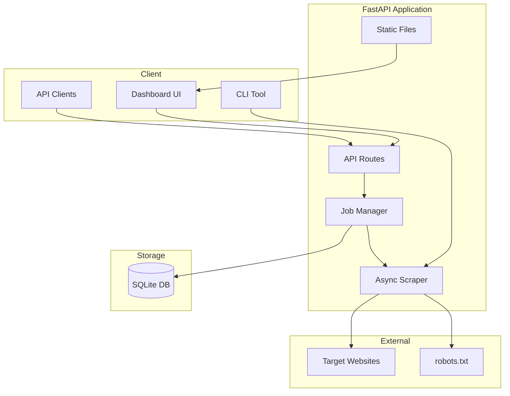

# Web Scraper Pro

> **Enterprise-ready web data extraction platform with async scraping, job queue, REST API, and premium dashboard UI.**

[](https://www.python.org/)
[](https://fastapi.tiangolo.com/)
[](https://www.docker.com/)
[](LICENSE)
[](https://github.com/D1bakar/web-scraper/actions/workflows/ci.yml)

Web Scraper Pro transforms polite, structured web extraction into a deployment-ready product. Launch scrape jobs from a modern dashboard or REST API, track progress in real time, export results as JSON/CSV/Excel, and persist job history in SQLite — all with robots.txt compliance, rate limiting, and retries built in.

---

## Features

- **FastAPI REST API** — async endpoints with OpenAPI docs at `/api/docs`
- **Premium dashboard UI** — dark glass-morphism SPA served at `/`
- **Five scrape modes** — quotes demo, page metadata, link extraction, table extraction, custom CSS selectors
- **Job queue system** — in-memory async queue with SQLite persistence (structured for Redis/Celery scale-up)
- **Robots.txt compliance** — automatic check before every scrape
- **Configurable scraping** — delay, timeout, retries, custom User-Agent
- **Multi-format export** — JSON, CSV, Excel (openpyxl)
- **Job history** — persisted scrape jobs and results in SQLite
- **CLI interface** — optional command-line tool for scripting
- **Docker-ready** — Dockerfile, docker-compose, health checks
- **CI/CD** — GitHub Actions lint and test pipeline

---

## Architecture



---

## Quick Start

### Local Development

```bash
git clone https://github.com/D1bakar/web-scraper.git
cd web-scraper

python -m venv .venv
# Linux/macOS: source .venv/bin/activate
# Windows:     .venv\Scripts\activate

pip install -r requirements.txt
cp .env.example .env

# Start the server
uvicorn app.main:app --reload --host 0.0.0.0 --port 8000
```

Open **http://localhost:8000** for the dashboard, or **http://localhost:8000/api/docs** for API documentation.

### CLI (Optional)

```bash
python cli.py quotes --pages 3
python cli.py meta --url https://quotes.toscrape.com
python cli.py links --url https://quotes.toscrape.com
python cli.py tables --url https://example.com
```

---

## Docker Deployment

```bash
# Build and run with Docker Compose
docker compose up --build -d

# Or build manually
docker build -t web-scraper-pro .
docker run -p 8000:8000 -v scraper-data:/app/data web-scraper-pro
```

Health check: `GET http://localhost:8000/api/health`

---

## API Reference

| Method | Endpoint | Description |
|--------|----------|-------------|
| `GET` | `/api/health` | Health check for deployment |
| `GET` | `/api/settings` | Default scraping settings |
| `POST` | `/api/jobs` | Create a scrape job |
| `GET` | `/api/jobs` | List job history |
| `GET` | `/api/jobs/{id}` | Get job status |
| `GET` | `/api/jobs/{id}/results` | Get scrape results |
| `GET` | `/api/jobs/{id}/export?format=json\|csv\|xlsx` | Download export |

### Create a Job

```bash
curl -X POST http://localhost:8000/api/jobs \
  -H "Content-Type: application/json" \
  -d '{"mode": "meta", "url": "https://quotes.toscrape.com"}'
```

### Scrape Modes

| Mode | Description | Required Fields |
|------|-------------|-----------------|
| `quotes` | Paginated quotes from quotes.toscrape.com | — |
| `meta` | Page title, description, headings | `url` |
| `links` | Anchor link extraction | `url` |
| `tables` | HTML table extraction | `url` |
| `selectors` | Custom CSS selector extraction | `url`, `selectors` |

---

## Cloud Deployment

### Railway / Render

Use the included `Procfile`:

```
web: uvicorn app.main:app --host 0.0.0.0 --port ${PORT:-8000}
```

Set environment variables from `.env.example`. Mount persistent storage for `DATABASE_URL` if you need durable job history.

### Environment Variables

| Variable | Default | Description |
|----------|---------|-------------|
| `HOST` | `0.0.0.0` | Server bind address |
| `PORT` | `8000` | Server port |
| `DATABASE_URL` | `sqlite:///./data/scraper.db` | SQLite database path |
| `DEFAULT_DELAY` | `1.0` | Seconds between requests |
| `DEFAULT_TIMEOUT` | `15` | Request timeout (seconds) |
| `DEFAULT_RETRIES` | `3` | Retry attempts on failure |
| `CHECK_ROBOTS_TXT` | `true` | Enforce robots.txt compliance |
| `LOG_LEVEL` | `INFO` | Logging verbosity |

---

## Project Structure

```
web-scraper/
├── app/
│   ├── main.py              # FastAPI entry point
│   ├── api/routes.py        # REST API endpoints
│   ├── core/
│   │   ├── scraper.py       # Async scraping engine
│   │   ├── jobs.py          # Job queue manager
│   │   ├── robots.py        # robots.txt checker
│   │   ├── exporters.py     # JSON/CSV/Excel export
│   │   └── config.py        # Environment config
│   ├── models/schemas.py    # Pydantic models
│   ├── db/                  # SQLAlchemy models & session
│   └── static/              # Dashboard UI assets
├── cli.py                   # Optional CLI
├── tests/                   # pytest suite
├── Dockerfile
├── docker-compose.yml
├── Procfile
├── .github/workflows/ci.yml
├── .env.example
└── requirements.txt
```

---

## Screenshots

> _Dashboard, job history, and results views — add screenshots after first deploy._

| Dashboard | Job History | Results Export |
|-----------|-------------|----------------|
| _Coming soon_ | _Coming soon_ | _Coming soon_ |

---

## Development

```bash
pip install -r requirements-dev.txt
ruff check app/ cli.py tests/
pytest tests/ -v
```

---

## Ethics & Responsible Scraping

Web scraping carries real responsibility. This platform includes robots.txt compliance and polite defaults, but **you** are accountable for how it is used.

- Check `robots.txt` and Terms of Service before scraping any site
- Use configurable delays to avoid overloading servers
- Respect rate limits and back off on errors
- Do not scrape authenticated, paywalled, or prohibited content

---

## License

This project is released under the [MIT License](LICENSE).

---

<p align="center">
  <sub>Web Scraper Pro — enterprise-ready data extraction, engineered for clarity and responsible use.</sub>
</p>
