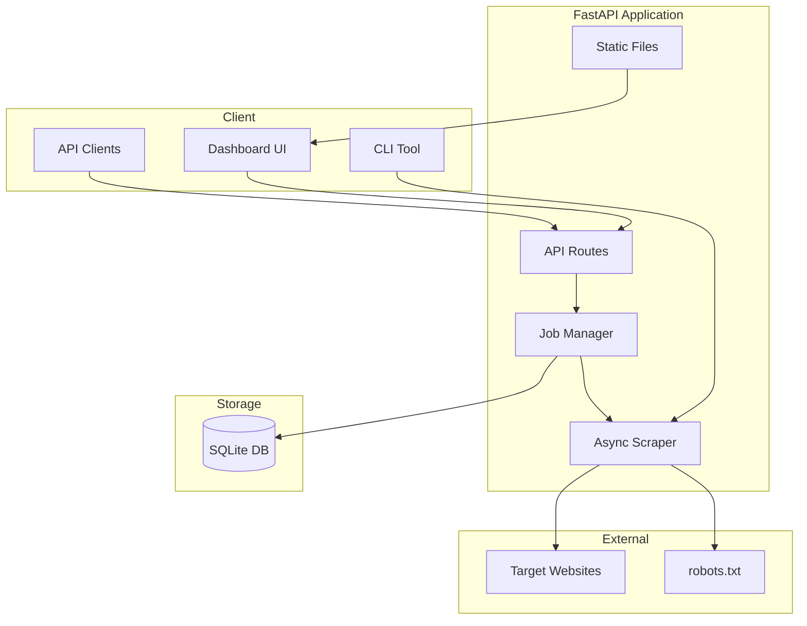

<p align="center">
  <strong>⚡ Web Scraper Pro</strong><br>
  <em>Enterprise-grade web data extraction — API, dashboard, job queue, and exports in one deployable platform.</em>
</p>

<p align="center">
  <a href="https://www.python.org/"></a>
  <a href="https://fastapi.tiangolo.com/"></a>
  <a href="https://www.docker.com/"></a>
  <a href="LICENSE"></a>
  <a href="https://github.com/D1bakar/web-scraper/actions/workflows/ci.yml"></a>
</p>

<p align="center">
  <a href="#quick-start">Quick Start</a> ·
  <a href="#api-reference">API</a> ·
  <a href="docs/WHY.md">Why Web Scraper Pro</a> ·
  <a href="/api/docs">Live API Docs</a> ·
  <a href="CONTRIBUTING.md">Contributing</a>
</p>

---

Web Scraper Pro transforms polite, structured web extraction into a **deployment-ready product**. Launch scrape jobs from a modern dashboard or REST API, track progress in real time, export results as JSON/CSV/Excel, and persist job history in SQLite — all with robots.txt compliance, rate limiting, and retries built in.

> **Industry-ready by design** — FastAPI backend, OpenAPI docs, Docker image, GitHub Actions CI, and cloud Procfile. See [docs/WHY.md](docs/WHY.md) for the enterprise value proposition.

---

## Features

| Category | Highlights |
|----------|------------|
| **API** | Async FastAPI REST endpoints with OpenAPI at [`/api/docs`](#live-api-documentation) |
| **UI** | Premium dark glass-morphism dashboard at `/` |
| **Modes** | Quotes demo, page metadata, links, tables, custom CSS selectors |
| **Jobs** | Async queue with SQLite persistence (structured for Redis/Celery scale-up) |
| **Compliance** | Automatic robots.txt checks before every scrape |
| **Export** | JSON, CSV, Excel (openpyxl) download endpoints |
| **Ops** | Docker, health checks, env-based config, CI/CD pipeline |
| **CLI** | Optional scripting interface via `cli.py` |

---

## Architecture



---

## Quick Start

### Windows (PowerShell)

Run from the `web-scraper` folder:

```powershell
cd web-scraper
.\start.ps1
```

Or manually:

```powershell
cd web-scraper
python -m venv .venv
.\.venv\Scripts\python.exe -m pip install -r requirements.txt
Copy-Item .env.example .env
.\.venv\Scripts\python.exe -m uvicorn app.main:app --host 127.0.0.1 --port 8000 --reload
```

### Linux / macOS

```bash
git clone https://github.com/D1bakar/web-scraper.git
cd web-scraper

python -m venv .venv
source .venv/bin/activate

pip install -r requirements.txt
cp .env.example .env

uvicorn app.main:app --reload --host 0.0.0.0 --port 8000
```

Open **http://127.0.0.1:8000** for the dashboard, or **http://127.0.0.1:8000/api/docs** for interactive API documentation.

> **Note:** Run `uvicorn` from inside the virtual environment. `requirements.txt` lives in `web-scraper/`, not the parent workspace.

### Docker

```bash
docker compose up --build -d
# Health: GET http://localhost:8000/api/health
```

### CLI (Optional)

```bash
python cli.py quotes --pages 3
python cli.py meta --url https://quotes.toscrape.com
python cli.py links --url https://quotes.toscrape.com
python cli.py tables --url https://example.com
```

---

## Dashboard Preview

The built-in SPA provides job configuration, live status, history, and export — no separate frontend repo required.

```
┌─────────────────────────────────────────────────────────────────────┐
│  ⚡ Web Scraper Pro          │  New Scrape Job                      │
│  Data Extraction Platform    │  Configure and launch extraction     │
│                              │                                      │
│  ▶ New Scrape                │  Scrape Mode  [ Page Metadata    ▼ ] │
│    Job History               │  Target URL   [ https://...        ] │
│    Settings                  │  Max Pages    [ 10 ]  ☑ Same domain  │
│                              │                                      │
│  API Docs  ● healthy         │  [ Start Scraping ]                  │
└─────────────────────────────────────────────────────────────────────┘
```

| View | Description |
|------|-------------|
| **New Scrape** | Configure mode, URL, selectors, and launch jobs |
| **Job History** | Browse past jobs with status, progress, and timestamps |
| **Results Export** | Download completed jobs as JSON, CSV, or Excel |

---

## Live API Documentation

| Endpoint | Description |
|----------|-------------|
| `/api/docs` | Swagger UI (interactive) |
| `/api/redoc` | ReDoc reference |
| `/api/openapi.json` | OpenAPI 3 schema |

---

## API Reference

| Method | Endpoint | Description |
|--------|----------|-------------|
| `GET` | `/api/health` | Health check for deployment |
| `GET` | `/api/settings` | Default scraping settings |
| `POST` | `/api/jobs` | Create a scrape job |
| `GET` | `/api/jobs` | List job history |
| `GET` | `/api/jobs/{id}` | Get job status |
| `GET` | `/api/jobs/{id}/results` | Get scrape results |
| `GET` | `/api/jobs/{id}/export?format=json\|csv\|xlsx` | Download export |

### Create a Job

```bash
curl -X POST http://localhost:8000/api/jobs \
  -H "Content-Type: application/json" \
  -d '{"mode": "meta", "url": "https://quotes.toscrape.com"}'
```

### Scrape Modes

| Mode | Description | Required Fields |
|------|-------------|-----------------|
| `quotes` | Paginated quotes from quotes.toscrape.com | — |
| `meta` | Page title, description, headings | `url` |
| `links` | Anchor link extraction | `url` |
| `tables` | HTML table extraction | `url` |
| `selectors` | Custom CSS selector extraction | `url`, `selectors` |

---

## Cloud Deployment

### Railway / Render

Use the included `Procfile`:

```
web: uvicorn app.main:app --host 0.0.0.0 --port ${PORT:-8000}
```

Set environment variables from `.env.example`. Mount persistent storage for `DATABASE_URL` if you need durable job history.

### Docker (Production)

```bash
docker build -t web-scraper-pro .
docker run -p 8000:8000 -v scraper-data:/app/data web-scraper-pro
```

### Environment Variables

| Variable | Default | Description |
|----------|---------|-------------|
| `HOST` | `0.0.0.0` | Server bind address |
| `PORT` | `8000` | Server port |
| `DATABASE_URL` | `sqlite:///./data/scraper.db` | SQLite database path |
| `DEFAULT_DELAY` | `1.0` | Seconds between requests |
| `DEFAULT_TIMEOUT` | `15` | Request timeout (seconds) |
| `DEFAULT_RETRIES` | `3` | Retry attempts on failure |
| `CHECK_ROBOTS_TXT` | `true` | Enforce robots.txt compliance |
| `LOG_LEVEL` | `INFO` | Logging verbosity |

---

## Project Structure

```
web-scraper/
├── app/
│   ├── main.py              # FastAPI entry point
│   ├── api/routes.py        # REST API endpoints
│   ├── core/
│   │   ├── scraper.py       # Async scraping engine
│   │   ├── jobs.py          # Job queue manager
│   │   ├── robots.py        # robots.txt checker
│   │   ├── exporters.py     # JSON/CSV/Excel export
│   │   └── config.py        # Environment config
│   ├── models/schemas.py    # Pydantic models
│   ├── db/                  # SQLAlchemy models & session
│   └── static/              # Dashboard UI (HTML/CSS/JS)
├── docs/WHY.md              # Enterprise value proposition
├── cli.py                   # Optional CLI
├── tests/                   # pytest suite
├── Dockerfile
├── docker-compose.yml
├── Procfile
├── .github/workflows/ci.yml
├── CONTRIBUTING.md
├── SECURITY.md
├── LICENSE
├── .env.example
└── requirements.txt
```

---

## Development

```bash
pip install -r requirements-dev.txt
ruff check app/ cli.py tests/
pytest tests/ -v
```

---

## Contributing

Contributions are welcome. Please read [CONTRIBUTING.md](CONTRIBUTING.md) for setup, testing, and pull request guidelines.

---

## Ethics & Responsible Scraping

Web scraping carries real responsibility. This platform includes robots.txt compliance and polite defaults, but **you** are accountable for how it is used.

- Check `robots.txt` and Terms of Service before scraping any site
- Use configurable delays to avoid overloading servers
- Respect rate limits and back off on errors
- Do not scrape authenticated, paywalled, or prohibited content

---

## License

This project is released under the [MIT License](LICENSE).

---

<p align="center">
  <sub>Web Scraper Pro — enterprise-ready data extraction, engineered for clarity and responsible use.</sub><br>
  <sub><a href="https://github.com/D1bakar/web-scraper">github.com/D1bakar/web-scraper</a></sub>
</p>
