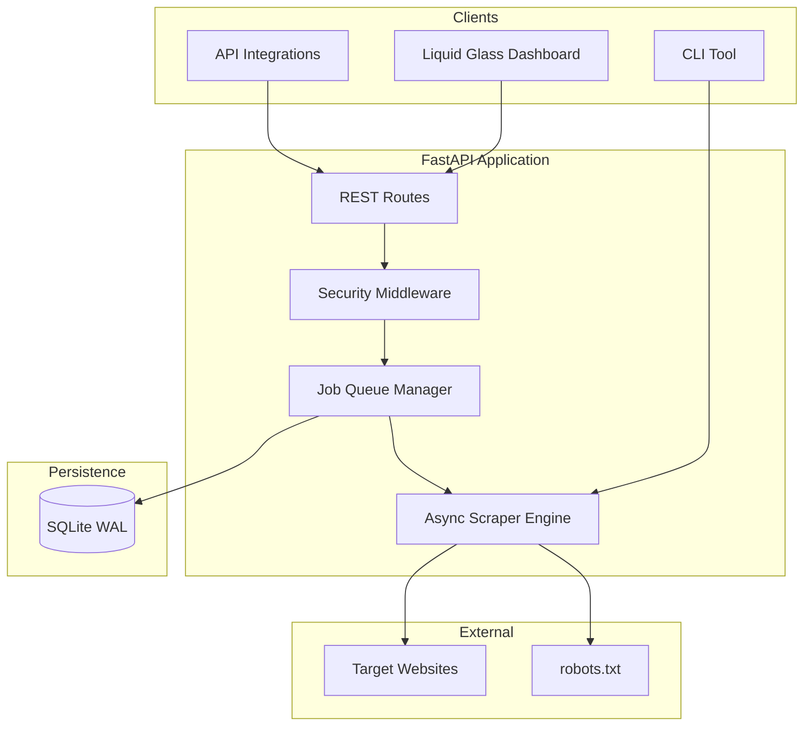

<pre align="center">
╔══════════════════════════════════════════════════════════════════╗
║                                                                  ║
║   ⚡  W E B   S C R A P E R   P R O  ⚡                           ║
║                                                                  ║
║        E X T R A C T   T H E   W E B .   I N S T A N T L Y .     ║
║                                                                  ║
╚══════════════════════════════════════════════════════════════════╝
</pre>

<p align="center">
  <strong>The open-source scraper that makes BeautifulSoup scripts look prehistoric.</strong>
</p>

<p align="center">
  <a href="https://www.python.org/"></a>
  <a href="https://fastapi.tiangolo.com/"></a>
  <a href="https://www.docker.com/"></a>
  <a href="LICENSE"></a>
  <a href="https://github.com/D1bakar/web-scraper/actions/workflows/ci.yml"></a>
  <a href="https://github.com/D1bakar/web-scraper/releases"></a>
  <a href="docs/MOBILE.md"></a>
  <a href="docs/MOBILE.md"></a>
  <a href="https://github.com/D1bakar/web-scraper/stargazers"></a>
</p>

<p align="center">
  <a href="#quick-start">Quick Start</a> ·
  <a href="#features">Features</a> ·
  <a href="#why-its-different">Why Different</a> ·
  <a href="docs/HOW_TO_COMPARE_PRICES.md">Price Compare</a> ·
  <a href="/api/docs">API Docs</a> ·
  <a href="docs/DEPLOYMENT.md">Deploy</a> ·
  <a href="PRODUCT.md">Vision</a> ·
  <a href="CONTRIBUTING.md">Contribute</a>
</p>

---

## One line. One platform. Zero excuses.

Deploy a **liquid glass dashboard**, **REST API**, **job queue**, and **11 extraction modes** in under 60 seconds. Track jobs in real time, export JSON/CSV/Excel, and sleep knowing SSRF protection, rate limits, and robots.txt compliance are built in.

> **v2.4.0 — Mobile-First Release:** bottom nav, PWA install, mobile cards, admin login, schedules/webhooks/API keys MVP. [Mobile guide](docs/MOBILE.md) · [Audit](docs/MOBILE_AUDIT.md)

---

## Troubleshooting

| Symptom | Fix |
|---------|-----|
| New modes (`sitemap`, `email_extract`, etc.) return **422 enum error** | An **old server** is still running. Stop it and restart: run `.\start.bat` (Windows) or `uvicorn app.main:app --reload`. Confirm **`/api/health` shows version 2.3.1**. |
| Jobs fail with **ROBOTS_BLOCKED** | Click **Try example** (auto-disables robots for demos) or uncheck **Check robots.txt** in Settings. Use **Quotes Demo** for a guaranteed first run. |
| **Rate limit exceeded** during rapid testing | Health checks and job polling are exempt in v2.3.1. Restart the server after upgrading. Default limit is **120 POST requests/min** (360 on localhost). |
| Hero overlay won't dismiss | Click **Launch Dashboard**, press **Escape**, or clear `localStorage` key `wsp_hero_seen`. |
| Port **8000 already in use** | `start.ps1` / `start.bat` now stops stale listeners automatically. Or run `netstat -ano \| findstr :8000` and stop the PID manually. |
| **Phone can't open dashboard** | Run **`phone-setup.bat`**. Still failing? Use **`start-tunnel.bat`**. Full guide: [docs/TROUBLESHOOTING.md](docs/TROUBLESHOOTING.md) |
| Empty price compare results | Verify your CSS selector matches the price element. Use **Smart hints** or the demo selector `.price_color` on books.toscrape.com. |

---

## Dashboard Preview

> **Screenshot placeholders** — replace with GIFs when you record demos.

| View | What you'll see |
|------|-----------------|
| **Hero overlay** | Full-screen intro — *"Extract the web. Instantly."* with floating orbs and iridescent glass |
| **Mode grid** | 11 clickable mode cards with glow selection — not a boring dropdown |
| **Live scrape** | Real-time progress bar, skeleton shimmer, morphing view transitions |
| **Price compare** | Animated CSS bar chart ranking prices lowest → highest |
| **Success moment** | Confetti pulse when your job completes — built for screenshots |
| **Share row** | Copy results · Share on Twitter with pre-filled tweet |

```
┌─────────────────────────────────────────────────────────────┐
│  ⚡ Web Scraper Pro          [New Scrape] [History] [Health] │
│  ─────────────────────────────────────────────────────────  │
│  ░░░ Liquid glass panels · animated gradient mesh ░░░       │
│  ┌─────────┐ ┌─────────┐ ┌─────────┐ ┌─────────┐           │
│  │💰 Price │ │📖 Quotes│ │🗺️ Sitemap│ │📧 Email │  ...      │
│  └─────────┘ └─────────┘ └─────────┘ └─────────┘           │
│  ┌─────────────────────────────────────────────────────┐   │
│  │  Live Status ████████████░░░░  78%                   │   │
│  └─────────────────────────────────────────────────────┘   │
│  Powered by open source · MIT                               │
└─────────────────────────────────────────────────────────────┘
```

---

## Features

| | Mode | What it does |
|---|------|--------------|
| 💰 | **Price Compare** | Compare prices across up to 50 URLs + CSV import + smart selector hints |
| 📖 | **Quotes Demo** | Safe first-run demo — no URL needed |
| 🏷️ | **Page Metadata** | Title, description, H1–H3 (+ batch CSV) |
| 🔗 | **Link Extraction** | All hyperlinks with anchor text |
| 📊 | **Table Extraction** | HTML tables → structured rows |
| 🎯 | **Custom Selectors** | CSS selector matching with AI-style hints |
| 🗺️ | **Sitemap Crawl** | Extract all URLs from sitemap.xml |
| 📧 | **Email Extract** | Find emails in text + mailto links |
| 📦 | **JSON-LD** | schema.org products, prices, ratings |
| 📱 | **Social Meta** | Open Graph + Twitter Card metadata |
| 📰 | **Readability** | Clean article text — strips nav & ads |

**Plus:** REST API + OpenAPI · Job queue + SQLite history · JSON/CSV/Excel export · Webhooks · Docker · CI · 39+ tests · **Security fortress** (SSRF, rate limit, API key, CSP)

---

## Why It's Different

| | DIY Script | Scrapy | Octoparse | **Web Scraper Pro** |
|---|:---:|:---:|:---:|:---:|
| Time to first scrape | Hours | Days | Minutes | **60 seconds** |
| Dashboard UI | ❌ | ❌ | ✅ (SaaS) | **✅ Liquid glass** |
| REST API + OpenAPI | DIY | Partial | Limited | **✅ Built-in** |
| Price compare mode | DIY | DIY | Template | **✅ First-class** |
| 11 extraction modes | ❌ | Templates | Visual | **✅ Out of the box** |
| Self-hosted / MIT | ✅ | ✅ | ❌ | **✅** |
| Security fortress | ❌ | Partial | Vendor | **✅ SSRF + rate limit** |
| Screenshot-worthy | ❌ | ❌ | ❌ | **✅ Built for sharing** |

Full breakdown → [docs/WHY_DIFFERENT.md](docs/WHY_DIFFERENT.md)

---

## Architecture



---

## Quick Start

Three commands. That's it.

```bash
git clone https://github.com/D1bakar/web-scraper.git && cd web-scraper
python -m venv .venv && source .venv/bin/activate  # Windows: .\.venv\Scripts\activate
pip install -r requirements.txt && cp .env.example .env && uvicorn app.main:app --reload
```

**Windows:** run `.\start.bat` from the `web-scraper` folder — creates venv, installs deps, starts server.

Open **http://127.0.0.1:8000** → click through the hero → pick a mode → hit **Try example** → watch the magic.

---

## Demo Video

> **Coming soon** — 60-second walkthrough: hero → mode grid → price compare → confetti → export.

Subscribe to releases on GitHub to get notified when the demo drops.

---

## Built for the Open Source Community

Web Scraper Pro is **MIT licensed** and **self-hosted by design**. No vendor lock-in. No surprise bills. Fork it, extend it, deploy it on Railway, Render, Docker, or your VPS.

- [OPEN_SOURCE.md](OPEN_SOURCE.md) — manifesto & principles
- [PRODUCT.md](PRODUCT.md) — vision & why it's revolutionary
- [docs/SOCIAL.md](docs/SOCIAL.md) — tweets & captions for sharing
- [CONTRIBUTING.md](CONTRIBUTING.md) — join the build
- [CONTRIBUTORS.md](CONTRIBUTORS.md) — hall of fame

---

## Documentation

| Doc | Description |
|-----|-------------|
| [PRODUCT.md](PRODUCT.md) | Vision & revolutionary positioning |
| [docs/WHY_DIFFERENT.md](docs/WHY_DIFFERENT.md) | Comparison vs Scrapy, Octoparse, scripts |
| [docs/HOW_TO_COMPARE_PRICES.md](docs/HOW_TO_COMPARE_PRICES.md) | Step-by-step price compare guide |
| [docs/DEPLOYMENT.md](docs/DEPLOYMENT.md) | Docker, Railway, Render, production |
| [docs/ROADMAP.md](docs/ROADMAP.md) | What's next |
| [docs/SOCIAL.md](docs/SOCIAL.md) | Share-ready tweets & captions |
| [SECURITY.md](SECURITY.md) | Security model |
| [CHANGELOG.md](CHANGELOG.md) | Release history |

---

## API at a Glance

| Method | Endpoint | Description |
|--------|----------|-------------|
| `GET` | `/api/health` | Health check |
| `GET` | `/api/health/detail` | System dashboard data |
| `POST` | `/api/jobs` | Create scrape job |
| `GET` | `/api/jobs/{id}/results` | Fetch results |
| `GET` | `/api/jobs/{id}/export?format=json\|csv\|xlsx` | Download export |
| `GET` | `/api/selector-hints?url=...` | Smart CSS selector suggestions |

Interactive docs: **http://127.0.0.1:8000/api/docs**

---

## Contributors Welcome

PRs, issues, and ideas make this project better. Look for `good first issue` labels or add a new scrape mode.

1. Fork → branch → `pytest tests/ -v` → PR
2. Read [CONTRIBUTING.md](CONTRIBUTING.md) and [CODE_OF_CONDUCT](.github/CODE_OF_CONDUCT.md)

---

## If This Saved You Hours, ⭐ the Repo

Every star helps developers discover a better way to scrape. It takes one click and means the world.

**[⭐ Star on GitHub](https://github.com/D1bakar/web-scraper/stargazers)**

[](https://star-history.com/#D1bakar/web-scraper&Date)

---

## License

MIT — see [LICENSE](LICENSE). Use freely in personal, commercial, and enterprise projects.

<p align="center">
  <strong>Web Scraper Pro</strong> — Extract the web. Instantly.<br>
  <a href="https://github.com/D1bakar/web-scraper">github.com/D1bakar/web-scraper</a>
</p>
